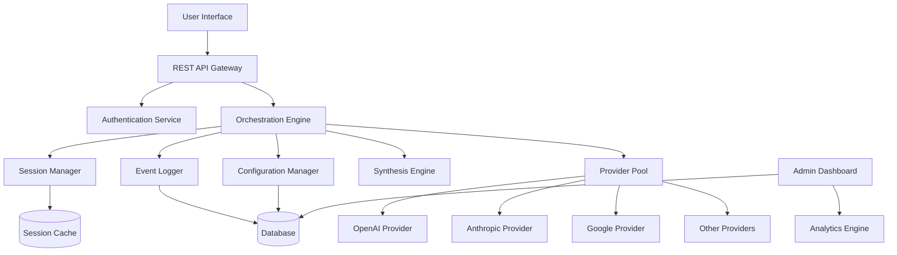

# Design Document

## Overview

The AI Council Proxy is a distributed system that orchestrates multi-model AI deliberations to produce high-quality consensus responses. The architecture follows a layered approach with clear separation between the user-facing interface, orchestration logic, provider integrations, and monitoring infrastructure.

The system operates on a request-response cycle where user queries are distributed to multiple AI models (Council Members), their responses are collected and shared for peer review across configurable deliberation rounds, and finally synthesized into a unified consensus decision. All interactions are logged for monitoring, cost tracking, and quality analysis.

Key design principles:
- **Transparency by default internally, opacity by default externally**: Full logging for administrators, clean single-response UX for users
- **Graceful degradation**: System remains operational even when providers fail
- **Configurability**: Administrators control council composition, deliberation depth, synthesis strategy, and performance constraints
- **Cost awareness**: Track and optimize spending across providers
- **Performance-first**: Streaming responses, timeout handling, and fast fallback modes

## Architecture

### High-Level Architecture



### Component Layers

1. **Presentation Layer**
   - User Interface (web/mobile)
   - Admin Dashboard
   - REST API Gateway

2. **Application Layer**
   - Orchestration Engine
   - Synthesis Engine
   - Session Manager
   - Configuration Manager

3. **Integration Layer**
   - Provider Pool
   - Provider Adapters (OpenAI, Anthropic, Google, etc.)
   - Retry/Timeout Logic

4. **Data Layer**
   - Event Logger
   - Database (PostgreSQL)
   - Session Cache (Redis)

5. **Analytics Layer**
   - Metrics Aggregation
   - Cost Calculator
   - Performance Analyzer

## Components and Interfaces

### 1. REST API Gateway

**Responsibilities:**
- Accept incoming user requests
- Validate authentication credentials
- Return request identifiers
- Stream responses when requested
- Handle CORS and rate limiting

**Interface:**

```typescript
interface APIGateway {
  // Submit a new request
  POST /api/v1/requests
  Body: {
    query: string;
    sessionId?: string;
    streaming?: boolean;
  }
  Response: {
    requestId: string;
    status: 'processing' | 'completed' | 'failed';
  }
  
  // Get request status and response
  GET /api/v1/requests/:requestId
  Response: {
    requestId: string;
    status: 'processing' | 'completed' | 'failed';
    consensusDecision?: string;
    createdAt: timestamp;
    completedAt?: timestamp;
  }
  
  // Stream response (SSE)
  GET /api/v1/requests/:requestId/stream
  Response: Server-Sent Events stream
}
```

### 2. Orchestration Engine

**Responsibilities:**
- Coordinate the entire request lifecycle
- Distribute requests to Council Members
- Manage deliberation rounds
- Trigger synthesis
- Handle timeouts and failures
- Enforce quorum requirements (if configured)

**Interface:**

```typescript
interface OrchestrationEngine {
  processRequest(request: UserRequest): Promise<ConsensusDecision>;
  
  distributeToCouncil(
    request: UserRequest,
    councilMembers: CouncilMember[]
  ): Promise<InitialResponse[]>;
  
  conductDeliberation(
    initialResponses: InitialResponse[],
    rounds: number
  ): Promise<DeliberationThread>;
  
  handleTimeout(
    partialResponses: Response[]
  ): Promise<ConsensusDecision>;
}

interface UserRequest {
  id: string;
  query: string;
  sessionId?: string;
  context?: ConversationContext;
  timestamp: Date;
}

interface CouncilMember {
  id: string;
  provider: string;
  model: string;
  version?: string;
  weight?: number;
  timeout: number;
  retryPolicy: RetryPolicy;
}

interface InitialResponse {
  councilMemberId: string;
  content: string;
  tokenUsage: TokenUsage;
  latency: number;
  timestamp: Date;
}

interface DeliberationThread {
  rounds: DeliberationRound[];
  totalDuration: number;
}

interface DeliberationRound {
  roundNumber: number;
  exchanges: Exchange[];
}

interface Exchange {
  councilMemberId: string;
  content: string;
  referencesTo: string[]; // IDs of responses being critiqued
  tokenUsage: TokenUsage;
}
```

### 3. Provider Pool

**Responsibilities:**
- Manage connections to AI provider APIs
- Handle authentication and API keys
- Implement retry logic with exponential backoff
- Track provider health and availability
- Apply per-provider timeout settings

**Interface:**

```typescript
interface ProviderPool {
  sendRequest(
    member: CouncilMember,
    prompt: string,
    context?: ConversationContext
  ): Promise<ProviderResponse>;
  
  getProviderHealth(providerId: string): ProviderHealth;
  
  markProviderDisabled(
    providerId: string,
    reason: string
  ): void;
}

interface ProviderResponse {
  content: string;
  tokenUsage: TokenUsage;
  latency: number;
  success: boolean;
  error?: Error;
}

interface ProviderHealth {
  providerId: string;
  status: 'healthy' | 'degraded' | 'disabled';
  successRate: number;
  avgLatency: number;
  lastFailure?: Date;
}

interface TokenUsage {
  promptTokens: number;
  completionTokens: number;
  totalTokens: number;
}
```

### 4. Synthesis Engine

**Responsibilities:**
- Combine Council Member responses into consensus
- Apply configured synthesis strategy
- Select moderator for meta-synthesis
- Extract agreement/disagreement patterns
- Apply weights for weighted fusion

**Interface:**

```typescript
interface SynthesisEngine {
  synthesize(
    thread: DeliberationThread,
    strategy: SynthesisStrategy
  ): Promise<ConsensusDecision>;
  
  selectModerator(
    members: CouncilMember[],
    strategy: ModeratorStrategy
  ): CouncilMember;
}

type SynthesisStrategy = 
  | { type: 'consensus-extraction' }
  | { type: 'weighted-fusion'; weights: Map<string, number> }
  | { type: 'meta-synthesis'; moderatorStrategy: ModeratorStrategy };

type ModeratorStrategy =
  | { type: 'permanent'; memberId: string }
  | { type: 'rotate' }
  | { type: 'strongest' };

interface ConsensusDecision {
  content: string;
  confidence: 'high' | 'medium' | 'low';
  agreementLevel: number; // 0-1
  synthesisStrategy: SynthesisStrategy;
  contributingMembers: string[];
  timestamp: Date;
}
```

### 5. Session Manager

**Responsibilities:**
- Store and retrieve conversation history
- Manage session lifecycle
- Summarize old messages when context limit reached
- Expire inactive sessions
- Include relevant context with each request

**Interface:**

```typescript
interface SessionManager {
  getSession(sessionId: string): Promise<Session | null>;
  
  createSession(userId: string): Promise<Session>;
  
  addToHistory(
    sessionId: string,
    entry: HistoryEntry
  ): Promise<void>;
  
  getContextForRequest(
    sessionId: string,
    maxTokens: number
  ): Promise<ConversationContext>;
  
  expireInactiveSessions(
    inactivityThreshold: Duration
  ): Promise<number>;
}

interface Session {
  id: string;
  userId: string;
  history: HistoryEntry[];
  createdAt: Date;
  lastActivityAt: Date;
  contextWindowUsed: number;
}

interface HistoryEntry {
  role: 'user' | 'assistant';
  content: string;
  timestamp: Date;
  requestId?: string;
}

interface ConversationContext {
  messages: HistoryEntry[];
  totalTokens: number;
  summarized: boolean;
}
```

### 6. Configuration Manager

**Responsibilities:**
- Store and retrieve system configuration
- Validate configuration changes
- Provide configuration presets
- Track configuration versions
- Notify components of configuration updates

**Interface:**

```typescript
interface ConfigurationManager {
  getCouncilConfig(): Promise<CouncilConfig>;
  
  updateCouncilConfig(config: CouncilConfig): Promise<void>;
  
  getDeliberationConfig(): Promise<DeliberationConfig>;
  
  getSynthesisConfig(): Promise<SynthesisConfig>;
  
  getPerformanceConfig(): Promise<PerformanceConfig>;
  
  applyPreset(preset: ConfigPreset): Promise<void>;
}

interface CouncilConfig {
  members: CouncilMember[];
  minimumSize: number;
  requireMinimumForConsensus: boolean;
}

interface DeliberationConfig {
  rounds: number; // 0-5
  preset: 'fast' | 'balanced' | 'thorough' | 'research-grade';
}

interface SynthesisConfig {
  strategy: SynthesisStrategy;
  moderatorStrategy?: ModeratorStrategy;
  weights?: Map<string, number>;
}

interface PerformanceConfig {
  globalTimeout: number; // seconds
  enableFastFallback: boolean;
  streamingEnabled: boolean;
}

type ConfigPreset = 
  | 'fast-council'
  | 'balanced-council'
  | 'research-council';
```

### 7. Event Logger

**Responsibilities:**
- Log all requests, responses, and deliberations
- Record cost and performance metrics
- Store configuration snapshots
- Enable audit trail
- Support analytics queries

**Interface:**

```typescript
interface EventLogger {
  logRequest(request: UserRequest): Promise<void>;
  
  logCouncilResponse(
    requestId: string,
    response: InitialResponse
  ): Promise<void>;
  
  logDeliberationRound(
    requestId: string,
    round: DeliberationRound
  ): Promise<void>;
  
  logConsensusDecision(
    requestId: string,
    decision: ConsensusDecision
  ): Promise<void>;
  
  logCost(
    requestId: string,
    cost: CostBreakdown
  ): Promise<void>;
  
  logProviderFailure(
    providerId: string,
    error: Error
  ): Promise<void>;
}

interface CostBreakdown {
  totalCost: number;
  currency: string;
  byProvider: Map<string, number>;
  byMember: Map<string, number>;
  pricingVersion: string;
}
```

### 8. Admin Dashboard

**Responsibilities:**
- Display recent requests and deliberations
- Show performance metrics (p50/p95/p99 latency)
- Visualize cost data
- Display agreement matrix heatmap
- Show influence scores
- Provide configuration interface
- Display red-team test results

**Interface:**

```typescript
interface Dashboard {
  getRecentRequests(
    limit: number,
    filters?: RequestFilters
  ): Promise<RequestSummary[]>;
  
  getDeliberationThread(
    requestId: string
  ): Promise<DeliberationThread>;
  
  getPerformanceMetrics(
    timeRange: TimeRange
  ): Promise<PerformanceMetrics>;
  
  getCostAnalytics(
    timeRange: TimeRange
  ): Promise<CostAnalytics>;
  
  getAgreementMatrix(): Promise<AgreementMatrix>;
  
  getInfluenceScores(): Promise<InfluenceScores>;
}

interface RequestSummary {
  requestId: string;
  query: string;
  status: string;
  consensusDecision: string;
  cost: number;
  latency: number;
  agreementLevel: number;
  timestamp: Date;
}

interface PerformanceMetrics {
  p50Latency: number;
  p95Latency: number;
  p99Latency: number;
  byCouncilSize: Map<number, LatencyStats>;
  byDeliberationRounds: Map<number, LatencyStats>;
  timeoutRate: number;
}

interface CostAnalytics {
  totalCost: number;
  byProvider: Map<string, number>;
  byMember: Map<string, number>;
  costPerRequest: number;
  projectedMonthlyCost: number;
}

interface AgreementMatrix {
  members: string[];
  disagreementRates: number[][]; // matrix of disagreement rates
}

interface InfluenceScores {
  scores: Map<string, number>; // member ID -> influence score (0-1)
}
```

## Data Models

### Database Schema

```sql
-- Requests table
CREATE TABLE requests (
  id UUID PRIMARY KEY,
  user_id VARCHAR(255),
  session_id UUID,
  query TEXT NOT NULL,
  status VARCHAR(50) NOT NULL,
  consensus_decision TEXT,
  agreement_level DECIMAL(3,2),
  total_cost DECIMAL(10,4),
  total_latency_ms INTEGER,
  created_at TIMESTAMP NOT NULL,
  completed_at TIMESTAMP,
  config_snapshot JSONB NOT NULL
);

-- Council responses table
CREATE TABLE council_responses (
  id UUID PRIMARY KEY,
  request_id UUID REFERENCES requests(id),
  council_member_id VARCHAR(255) NOT NULL,
  round_number INTEGER NOT NULL,
  content TEXT NOT NULL,
  token_usage JSONB NOT NULL,
  latency_ms INTEGER NOT NULL,
  cost DECIMAL(10,4),
  created_at TIMESTAMP NOT NULL
);

-- Deliberation exchanges table
CREATE TABLE deliberation_exchanges (
  id UUID PRIMARY KEY,
  request_id UUID REFERENCES requests(id),
  round_number INTEGER NOT NULL,
  council_member_id VARCHAR(255) NOT NULL,
  content TEXT NOT NULL,
  references_to TEXT[], -- array of response IDs
  token_usage JSONB NOT NULL,
  created_at TIMESTAMP NOT NULL
);

-- Sessions table
CREATE TABLE sessions (
  id UUID PRIMARY KEY,
  user_id VARCHAR(255) NOT NULL,
  created_at TIMESTAMP NOT NULL,
  last_activity_at TIMESTAMP NOT NULL,
  context_window_used INTEGER NOT NULL,
  expired BOOLEAN DEFAULT FALSE
);

-- Session history table
CREATE TABLE session_history (
  id UUID PRIMARY KEY,
  session_id UUID REFERENCES sessions(id),
  role VARCHAR(50) NOT NULL,
  content TEXT NOT NULL,
  request_id UUID,
  created_at TIMESTAMP NOT NULL
);

-- Configuration table
CREATE TABLE configurations (
  id UUID PRIMARY KEY,
  config_type VARCHAR(100) NOT NULL,
  config_data JSONB NOT NULL,
  version INTEGER NOT NULL,
  created_at TIMESTAMP NOT NULL,
  active BOOLEAN DEFAULT TRUE
);

-- Provider health table
CREATE TABLE provider_health (
  provider_id VARCHAR(255) PRIMARY KEY,
  status VARCHAR(50) NOT NULL,
  success_rate DECIMAL(5,4),
  avg_latency_ms INTEGER,
  last_failure_at TIMESTAMP,
  disabled_reason TEXT,
  updated_at TIMESTAMP NOT NULL
);

-- Cost tracking table
CREATE TABLE cost_records (
  id UUID PRIMARY KEY,
  request_id UUID REFERENCES requests(id),
  provider VARCHAR(255) NOT NULL,
  model VARCHAR(255) NOT NULL,
  prompt_tokens INTEGER NOT NULL,
  completion_tokens INTEGER NOT NULL,
  cost DECIMAL(10,4) NOT NULL,
  pricing_version VARCHAR(100) NOT NULL,
  created_at TIMESTAMP NOT NULL
);

-- Red team tests table
CREATE TABLE red_team_tests (
  id UUID PRIMARY KEY,
  test_name VARCHAR(255) NOT NULL,
  prompt TEXT NOT NULL,
  attack_category VARCHAR(100) NOT NULL,
  council_member_id VARCHAR(255) NOT NULL,
  response TEXT NOT NULL,
  compromised BOOLEAN NOT NULL,
  created_at TIMESTAMP NOT NULL
);

-- Indexes
CREATE INDEX idx_requests_user_id ON requests(user_id);
CREATE INDEX idx_requests_session_id ON requests(session_id);
CREATE INDEX idx_requests_created_at ON requests(created_at);
CREATE INDEX idx_council_responses_request_id ON council_responses(request_id);
CREATE INDEX idx_deliberation_exchanges_request_id ON deliberation_exchanges(request_id);
CREATE INDEX idx_session_history_session_id ON session_history(session_id);
CREATE INDEX idx_cost_records_request_id ON cost_records(request_id);
CREATE INDEX idx_cost_records_created_at ON cost_records(created_at);
```

### Cache Schema (Redis)

```
// Session cache
session:{sessionId} -> {
  userId: string,
  history: HistoryEntry[],
  lastActivityAt: timestamp,
  contextWindowUsed: number
}
TTL: 30 days

// Configuration cache
config:council -> CouncilConfig
config:deliberation -> DeliberationConfig
config:synthesis -> SynthesisConfig
config:performance -> PerformanceConfig
TTL: No expiry (invalidate on update)

// Provider health cache
provider:health:{providerId} -> ProviderHealth
TTL: 5 minutes

// Request status cache
request:status:{requestId} -> {
  status: string,
  progress: number
}
TTL: 1 hour
```

## Error Handling

### Error Categories

1. **Provider Errors**
   - API authentication failures
   - Rate limiting
   - Timeout
   - Model unavailability
   - Invalid responses

2. **System Errors**
   - Database connection failures
   - Cache unavailability
   - Configuration errors
   - Out of memory

3. **User Errors**
   - Invalid authentication
   - Malformed requests
   - Session expired
   - Rate limit exceeded

### Error Handling Strategy

**Provider Failures:**
- Retry with exponential backoff (configurable per provider)
- Continue with remaining Council Members
- Fall back to single model if minimum quorum not met
- Log all failures for monitoring

**Timeout Handling:**
- Per-provider timeouts
- Global request timeout
- When global timeout exceeded: synthesize with available responses
- Stream partial results if streaming enabled

**Graceful Degradation:**
- If N Council Members fail, continue with N-M successful members
- If below minimum quorum: return error or use strongest single model (configurable)
- Mark consistently failing providers as disabled
- Display warnings in dashboard

**Error Response Format:**

```typescript
interface ErrorResponse {
  error: {
    code: string;
    message: string;
    details?: any;
    retryable: boolean;
  };
  requestId?: string;
  timestamp: Date;
}
```

### Retry Policy

```typescript
interface RetryPolicy {
  maxAttempts: number;
  initialDelayMs: number;
  maxDelayMs: number;
  backoffMultiplier: number;
  retryableErrors: string[]; // error codes that should trigger retry
}

// Default retry policy
const DEFAULT_RETRY_POLICY: RetryPolicy = {
  maxAttempts: 3,
  initialDelayMs: 1000,
  maxDelayMs: 10000,
  backoffMultiplier: 2,
  retryableErrors: ['RATE_LIMIT', 'TIMEOUT', 'SERVICE_UNAVAILABLE']
};
```

## Testing Strategy

The AI Council Proxy will employ a comprehensive testing strategy combining unit tests, integration tests, and property-based tests to ensure correctness, reliability, and performance.

### Unit Testing

Unit tests will verify individual components in isolation:

**Components to test:**
- Provider adapters (mock API responses)
- Synthesis engine (test each strategy)
- Session manager (context window management)
- Configuration manager (validation logic)
- Cost calculator (pricing calculations)
- Retry logic (exponential backoff)

**Testing framework:** Jest (TypeScript/Node.js) or pytest (Python)

**Example unit tests:**
- Test that provider adapter correctly formats requests for each provider API
- Test that synthesis engine correctly extracts consensus from sample responses
- Test that session manager correctly summarizes old messages when context limit reached
- Test that cost calculator correctly computes costs given token usage and pricing

### Integration Testing

Integration tests will verify component interactions:

**Test scenarios:**
- End-to-end request flow with mocked provider responses
- Database persistence and retrieval
- Cache invalidation on configuration updates
- Timeout handling across multiple providers
- Session context propagation through request lifecycle

**Testing framework:** Jest with supertest for API testing

**Example integration tests:**
- Submit request → verify it's distributed to all configured Council Members
- Simulate provider failure → verify system continues with remaining members
- Update configuration → verify new requests use updated settings
- Exceed global timeout → verify synthesis triggered with partial responses

### Property-Based Testing

Property-based tests will verify universal correctness properties across many randomly generated inputs. We will use **fast-check** (JavaScript/TypeScript) or **Hypothesis** (Python) as the property testing library.

**Configuration:** Each property test will run a minimum of 100 iterations.

**Test tagging:** Each property-based test will include a comment explicitly referencing the correctness property from this design document using the format: `**Feature: ai-council-proxy, Property {number}: {property_text}**`

## Correctness Properties

*A property is a characteristic or behavior that should hold true across all valid executions of a system—essentially, a formal statement about what the system should do. Properties serve as the bridge between human-readable specifications and machine-verifiable correctness guarantees.*

### Request Processing Properties

Property 1: Request distribution completeness
*For any* user request and council configuration, when the orchestrator distributes the request, all configured council members should receive the request.
**Validates: Requirements 1.2**

Property 2: Synthesis produces single output
*For any* set of council member responses, the synthesis engine should produce exactly one consensus decision.
**Validates: Requirements 1.3**

Property 3: User interface hides deliberation by default
*For any* consensus decision displayed to the user when transparency mode is disabled, the output should not contain deliberation thread markers or council member identifiers.
**Validates: Requirements 1.5**

### Configuration Properties

Property 4: Configuration persistence round-trip
*For any* valid council configuration, saving then retrieving the configuration should produce an equivalent configuration.
**Validates: Requirements 2.3**

Property 5: Active configuration enforcement
*For any* request processed after a configuration update, only the council members specified in the active configuration should be used.
**Validates: Requirements 2.4**

Property 6: Deprecated model warnings
*For any* model marked as deprecated in the system, displaying that model in the configuration interface should include a deprecation warning.
**Validates: Requirements 2.6**

### Deliberation Properties

Property 7: Deliberation round count enforcement
*For any* deliberation configuration with N rounds where N > 0, the system should execute exactly N rounds of peer review before synthesis.
**Validates: Requirements 3.5**

Property 8: Peer response sharing completeness
*For any* set of initial council member responses, each council member should receive all other members' responses during deliberation.
**Validates: Requirements 3.2**

### Logging and Monitoring Properties

Property 9: Complete logging
*For any* processed request, the event log should contain all council member responses, all deliberation exchanges, and the final consensus decision.
**Validates: Requirements 4.1**

Property 10: Response attribution
*For any* logged response or deliberation exchange, the record should include the council member ID that provided it.
**Validates: Requirements 4.4**

Property 11: Agreement matrix computation
*For any* set of deliberation threads, the agreement matrix should correctly reflect the disagreement rates between each pair of council members.
**Validates: Requirements 4.6**

Property 12: Influence score computation
*For any* set of consensus decisions, the influence scores should correctly reflect how often each council member's position appears in final responses.
**Validates: Requirements 4.7**

### Cost Tracking Properties

Property 13: Cost calculation accuracy
*For any* council member API call with token usage, the calculated cost should equal the token count multiplied by the provider's pricing rate for that pricing version.
**Validates: Requirements 5.1**

Property 14: Cost aggregation correctness
*For any* request processed by multiple council members, the total cost should equal the sum of individual council member costs.
**Validates: Requirements 5.2**

Property 15: Cost alert triggering
*For any* configured cost threshold, when spending exceeds that threshold, an alert should be generated.
**Validates: Requirements 5.5**

Property 16: Pricing version tracking
*For any* cost record, the pricing version used for calculation should be logged with the record.
**Validates: Requirements 5.6**

### API Properties

Property 17: Request identifier generation
*For any* valid POST request to the API endpoint, a unique request identifier should be returned.
**Validates: Requirements 6.1**

Property 18: API round-trip consistency
*For any* request submitted via POST, retrieving the result via GET with the returned request ID should return the consensus decision for that request.
**Validates: Requirements 6.2**

Property 19: Authentication validation
*For any* API request with invalid credentials, the system should reject the request before processing.
**Validates: Requirements 6.4**

### Synthesis Strategy Properties

Property 20: Designated moderator usage
*For any* meta-synthesis configuration with a designated moderator, that specific council member should perform the synthesis.
**Validates: Requirements 7.2**

Property 21: Weighted fusion application
*For any* weighted fusion synthesis with configured weights, the synthesis prompt should include all council member contributions weighted according to the configuration.
**Validates: Requirements 7.4**

Property 22: Strongest moderator selection
*For any* meta-synthesis with strongest moderator strategy, the council member with the highest ranking should be selected as moderator.
**Validates: Requirements 7.6**

Property 23: Synthesis strategy persistence
*For any* saved synthesis strategy configuration, all subsequent requests should use that strategy until the configuration changes.
**Validates: Requirements 7.7**

### Session Management Properties

Property 24: Session identifier inclusion
*For any* user request submitted through the interface, the request should include a session identifier.
**Validates: Requirements 8.1**

Property 25: Session history retrieval
*For any* request with a valid session identifier, the system should retrieve and include the conversation history for that session.
**Validates: Requirements 8.2**

Property 26: Context inclusion in distribution
*For any* request distributed to council members, relevant conversation context should be included with the request.
**Validates: Requirements 8.3**

Property 27: Response storage in history
*For any* council member response, the response should be added to the session history.
**Validates: Requirements 8.4**

Property 28: Context window summarization
*For any* session that exceeds the configured context window limit, older messages should be summarized to maintain context within token limits.
**Validates: Requirements 8.5**

Property 29: Session expiration detection
*For any* session with age exceeding the configured inactivity timeout, the session should be marked as expired.
**Validates: Requirements 8.6**

### Failure Handling Properties

Property 30: Graceful degradation with partial responses
*For any* request where at least one council member successfully responds, a consensus decision should be produced using the available responses.
**Validates: Requirements 9.2**

Property 31: Automatic member disabling
*For any* council member that fails consistently beyond a threshold, the system should mark that member as temporarily disabled and exclude it from subsequent requests.
**Validates: Requirements 9.4**

Property 32: Disabled member warnings
*For any* disabled council member, the dashboard should display a warning indicating reduced council participation.
**Validates: Requirements 9.5**

### Timeout and Retry Properties

Property 33: Timeout enforcement
*For any* council member API call that exceeds the configured timeout, the system should cancel the request and proceed without that member's response.
**Validates: Requirements 10.2**

Property 34: Retry attempt count
*For any* council member with retry enabled, the system should attempt exactly the configured number of retries before marking the call as failed.
**Validates: Requirements 10.3**

Property 35: Configuration immediacy
*For any* timeout or retry setting modification, the new settings should apply to all subsequent requests immediately.
**Validates: Requirements 10.5**

Property 36: Per-provider configuration support
*For any* provider or model, the system should accept and store different timeout and retry values.
**Validates: Requirements 10.6**

### Performance Properties

Property 37: Global timeout synthesis trigger
*For any* request that exceeds the configured global timeout, synthesis should be immediately triggered using all responses received so far.
**Validates: Requirements 11.2**

Property 38: Percentile latency computation
*For any* time range, the dashboard should correctly compute p50, p95, and p99 latency values from the request latency data.
**Validates: Requirements 11.3**

Property 39: Streaming initiation timing
*For any* request with streaming enabled, partial consensus decision text should begin streaming as soon as synthesis begins.
**Validates: Requirements 11.6**

### Transparency Properties

Property 40: Transparency mode button display
*For any* user interface with transparency mode enabled in configuration, a button to reveal the full deliberation thread should be displayed.
**Validates: Requirements 12.1**

Property 41: Deliberation thread chronological ordering
*For any* revealed deliberation thread, all council member responses and exchanges should be displayed in chronological order.
**Validates: Requirements 12.2**

Property 42: Deliberation hiding when disabled
*For any* user interface with transparency mode disabled, the output should contain only the consensus decision without deliberation details.
**Validates: Requirements 12.4**

Property 43: Forced transparency override
*For any* configuration with forced transparency enabled, deliberation threads should always be displayed regardless of user preference.
**Validates: Requirements 12.5**

### Security Testing Properties

Property 44: Red-team prompt secure storage
*For any* configured red-team prompts, the prompts should be stored in a separate secure configuration location.
**Validates: Requirements 13.1**

Property 45: Red-team scheduled execution
*For any* scheduled red-team test with configured interval, the prompts should be routed to all council members at the specified interval.
**Validates: Requirements 13.2**

Property 46: Red-team result recording
*For any* red-team test execution, the system should record which council members resisted and which were compromised.
**Validates: Requirements 13.3**

Property 47: Red-team resistance rate display
*For any* red-team results viewed in the dashboard, resistance rates should be displayed per council member and per attack category.
**Validates: Requirements 13.4**

Property 48: Security warning generation
*For any* council member that consistently fails red-team tests, the dashboard should display a security warning for that member.
**Validates: Requirements 13.5**

## Security Considerations

### Authentication and Authorization

- API requests require valid authentication tokens
- Role-based access control for administrative functions
- Separate permissions for configuration changes vs. read-only dashboard access
- API key rotation support for provider credentials

### Data Protection

- Encrypt sensitive data at rest (API keys, user queries)
- Use TLS for all network communication
- Implement request/response sanitization to prevent injection attacks
- Store red-team prompts in separate secure storage with restricted access

### Rate Limiting

- Per-user rate limits to prevent abuse
- Per-provider rate limits to respect API quotas
- Configurable rate limit thresholds
- Graceful degradation when limits approached

### Audit Trail

- Log all configuration changes with user attribution
- Track all API access attempts
- Maintain immutable audit log for compliance
- Support log export for external analysis

## Performance Optimization

### Caching Strategy

- Cache active configuration in Redis for fast access
- Cache provider health status (5-minute TTL)
- Cache session data to reduce database queries
- Implement request deduplication for identical concurrent requests

### Parallel Processing

- Distribute requests to council members in parallel
- Use connection pooling for provider APIs
- Implement concurrent deliberation round processing where possible
- Stream synthesis results as they're generated

### Database Optimization

- Index frequently queried fields (request_id, session_id, created_at)
- Partition large tables by date for better query performance
- Use materialized views for dashboard analytics
- Implement read replicas for dashboard queries

### Resource Management

- Implement circuit breakers for failing providers
- Use connection pooling for database and cache
- Set memory limits for session context storage
- Implement request queuing with priority levels

## Deployment Architecture

### Recommended Infrastructure

```
Load Balancer
    |
    ├── API Gateway (3+ instances)
    |
    ├── Orchestration Service (5+ instances)
    |   ├── Provider Pool Workers
    |   └── Synthesis Workers
    |
    ├── Session Service (3+ instances)
    |
    ├── Dashboard Service (2+ instances)
    |
    ├── PostgreSQL (Primary + Replicas)
    |
    ├── Redis Cluster (3+ nodes)
    |
    └── Message Queue (for async processing)
```

### Scalability Considerations

- Horizontal scaling for API gateway and orchestration services
- Vertical scaling for synthesis operations (CPU-intensive)
- Database read replicas for dashboard queries
- Redis cluster for session storage
- Message queue for asynchronous deliberation processing

### Monitoring and Observability

- Metrics: Request latency, provider success rates, cost per request, cache hit rates
- Logging: Structured logs with request tracing
- Alerting: Provider failures, cost threshold breaches, performance degradation
- Dashboards: Real-time system health, cost trends, council performance

## Future Enhancements

### Potential Extensions

1. **Adaptive Council Composition**: Automatically adjust council membership based on query type or performance patterns
2. **Learning from Feedback**: Track user satisfaction and adjust synthesis strategies
3. **Multi-Modal Support**: Extend to support image, audio, and video inputs
4. **Specialized Councils**: Pre-configured councils for specific domains (medical, legal, technical)
5. **Cost Optimization Engine**: Automatically recommend council configurations that optimize cost-quality tradeoff
6. **A/B Testing Framework**: Test different synthesis strategies and council compositions
7. **Explainability Features**: Provide detailed explanations of why certain consensus decisions were reached
8. **Integration Marketplace**: Pre-built integrations with popular applications and workflows

