# Design Document

## Overview

This design document addresses critical bugs, major issues, and test flaws identified in the AI Council Proxy system through comprehensive code review. The bugs fall into several categories:

1. **Critical Bugs**: Timeout unit mismatches and member ID attribution issues that cause immediate system failures
2. **Major Bugs**: Race conditions, thread safety issues, and logic errors that cause incorrect behavior
3. **Moderate Bugs**: Validation gaps, comment mismatches, and implementation inconsistencies
4. **Minor Bugs**: Edge cases in token estimation and percentile calculation
5. **Test Flaws**: Property-based tests that generate invalid data or don't properly verify behavior

The fixes are designed to be surgical and focused, addressing each issue without introducing new problems. Where possible, we will add property-based tests to verify the fixes and prevent regressions.

## Architecture

The bug fixes span multiple components of the system:

```mermaid
graph TB
    OE[Orchestration Engine] -->|Timeout Units| Fix1[Fix 1: Unit Conversion]
    OE -->|Member Attribution| Fix2[Fix 2: Preserve IDs]
    
    BPA[Base Provider Adapter] -->|Timeout Units| Fix3[Fix 3: Unit Conversion]
    
    SM[Session Manager] -->|Race Conditions| Fix4[Fix 4: Atomic Operations]
    SM -->|Token Estimation| Fix12[Fix 12: Better Estimation]
    
    SE[Synthesis Engine] -->|Thread Safety| Fix5[Fix 5: Atomic Rotation]
    SE -->|Comment Accuracy| Fix7[Fix 7: Update Comments]
    
    AE[Analytics Engine] -->|Disagreement Logic| Fix6[Fix 6: Direct Comparison]
    AE -->|Null Handling| Fix8[Fix 8: Null Checks]
    AE -->|Percentile Calculation| Fix13[Fix 13: Correct Algorithm]
    
    CM[Configuration Manager] -->|Validation| Fix9[Fix 9: Reject Zero/Negative]
    CM -->|Preset Validation| Fix14[Fix 14: Validate First]
    
    CC[Cost Calculator] -->|Period Matching| Fix10[Fix 10: Exact Matching]
    
    PP[Provider Pool] -->|Failure Tracking| Fix11[Fix 11: Single Source]
    
    Tests[Property Tests] -->|Invalid Data| Fix15[Fix 15: Valid Arbitraries]
    Tests -->|Missing Verification| Fix16[Fix 16: Verify Features]
    Tests -->|Comparison Issues| Fix17[Fix 17: Proper Comparison]
    Tests -->|Tie Handling| Fix18[Fix 18: Handle Ties]
```



## Components and Interfaces

### 1. Orchestration Engine Fixes

**Issues:**
- Timeout unit mismatch (seconds vs milliseconds)
- Placeholder member IDs on global timeout

**Changes:**

```typescript
// Before (Bug):
setTimeout(() => {
  resolve({
    content: '',
    error: new Error(`Request to ${member.id} timed out after ${member.timeout}s`)
  });
}, timeoutMs); // timeoutMs calculated correctly, but error message could be wrong

// After (Fixed):
const timeoutMs = member.timeout * 1000; // Explicit conversion
setTimeout(() => {
  resolve({
    content: '',
    error: new Error(`Request to ${member.id} timed out after ${member.timeout}s`)
  });
}, timeoutMs);

// Member ID preservation fix:
// Before (Bug):
exchanges: successfulResponses.map((response, index) => ({
  councilMemberId: `member-${index}`, // Placeholder
  ...
}))

// After (Fixed):
exchanges: successfulResponses.map((response) => ({
  councilMemberId: response.councilMemberId, // Actual ID
  ...
}))
```

### 2. Base Provider Adapter Fixes

**Issues:**
- Timeout unit mismatch (seconds vs milliseconds)
- Error message says "ms" but value is in seconds

**Changes:**

```typescript
// Before (Bug):
setTimeout(() => {
  reject(new Error(`Request timeout after ${member.timeout}ms`));
}, member.timeout); // Should be member.timeout * 1000

// After (Fixed):
const timeoutMs = member.timeout * 1000;
setTimeout(() => {
  reject(new Error(`Request timeout after ${member.timeout}s`));
}, timeoutMs);
```

### 3. Session Manager Fixes

**Issues:**
- Race condition in cache updates
- Token estimation too simple

**Changes:**

```typescript
// Race condition fix:
// Before (Bug):
const session = await this.getSessionFromDatabase(sessionId);
if (session) {
  await this.cacheSession(session); // Another request may have modified DB
}

// After (Fixed):
// Use database transaction with SELECT FOR UPDATE or optimistic locking
const session = await this.db.query(
  'SELECT * FROM sessions WHERE id = $1 FOR UPDATE',
  [sessionId]
);
if (session.rows[0]) {
  await this.cacheSession(session.rows[0]);
}

// Token estimation fix:
// Before (Bug):
private estimateTokens(content: string): number {
  return Math.ceil(content.length / 4); // Too simple
}

// After (Fixed):
import { encoding_for_model } from '@dqbd/tiktoken';

// Cache encoders per model to avoid repeated initialization
private encoders: Map<string, any> = new Map();

private getEncoder(model: string): any {
  if (!this.encoders.has(model)) {
    try {
      this.encoders.set(model, encoding_for_model(model as any));
    } catch {
      this.encoders.set(model, encoding_for_model('gpt-4o')); // safe fallback
    }
  }
  return this.encoders.get(model);
}

private estimateTokens(content: string, model: string = 'gpt-4o'): number {
  try {
    const encoder = this.getEncoder(model);
    return encoder.encode(content).length;
  } catch {
    // Absolute fallback for unknown models
    return Math.ceil(content.length / 3.5);
  }
}
```

### 4. Synthesis Engine Fixes

**Issues:**
- Rotation index not thread-safe
- Comment mismatch for word filtering

**Changes:**

```typescript
// Thread safety fix:
// Before (Bug):
private rotationIndex: number = 0;
const selectedMember = members[this.rotationIndex % members.length];
this.rotationIndex++; // Not atomic

// After (Fixed):
// Option 1: Use atomic operations (if available)
private rotationIndex: AtomicInteger = new AtomicInteger(0);
const selectedMember = members[this.rotationIndex.getAndIncrement() % members.length];

// Option 2: Use mutex/lock
private rotationIndex: number = 0;
private rotationLock: Mutex = new Mutex();
await this.rotationLock.acquire();
try {
  const selectedMember = members[this.rotationIndex % members.length];
  this.rotationIndex++;
} finally {
  this.rotationLock.release();
}

// Comment fix:
// Before (Bug):
.filter(word => word.length > 2); // Filter out very short words (1-2 chars)

// After (Fixed):
.filter(word => word.length > 2); // Filter out very short words (1 and 2 chars)
```

### 5. Analytics Engine Fixes

**Issues:**
- Disagreement calculation measures consensus alignment, not member-to-member disagreement
- Null handling missing in query results
- Percentile calculation edge cases

**Changes:**

```typescript
// Disagreement calculation fix:
// Before (Bug):
const overlap1 = this.calculateOverlap(content1, consensus);
const overlap2 = this.calculateOverlap(content2, consensus);
if (Math.abs(overlap1 - overlap2) > 0.3) {
  disagreements++;
}

// After (Fixed):
const memberOverlap = this.calculateOverlap(content1, content2);
if (memberOverlap < 0.7) { // Direct comparison
  disagreements++;
}

// Null handling fix:
// Before (Bug):
for (const row of pairResult.rows) {
  // No null checks before accessing row.consensus_decision, etc.
}

// After (Fixed):
for (const row of pairResult.rows) {
  if (!row || !row.consensus_decision || !row.member1_content || !row.member2_content) {
    continue; // Skip invalid rows
  }
  // Process row
}

// Percentile calculation fix:
// Before (Bug):
private calculatePercentile(sortedValues: number[], percentile: number): number {
  if (sortedValues.length === 0) return 0;
  const index = Math.ceil(sortedValues.length * percentile) - 1;
  return sortedValues[Math.max(0, index)];
}

// After (Fixed):
private calculatePercentile(sortedValues: number[], percentile: number): number {
  if (sortedValues.length === 0) return 0;
  if (sortedValues.length === 1) return sortedValues[0];
  
  // Use linear interpolation for accurate percentiles
  const rank = percentile * (sortedValues.length - 1);
  const lowerIndex = Math.floor(rank);
  const upperIndex = Math.ceil(rank);
  const weight = rank - lowerIndex;
  
  return sortedValues[lowerIndex] * (1 - weight) + sortedValues[upperIndex] * weight;
}
```

### 6. Configuration Manager Fixes

**Issues:**
- Validation allows maxAttempts = 0
- Preset validation happens after getPresetConfigurations call

**Changes:**

```typescript
// Validation fix:
// Before (Bug):
if (policy.maxAttempts < 0) {
  throw new ConfigurationValidationError('Retry maxAttempts must be non-negative');
}

// After (Fixed):
if (policy.maxAttempts <= 0) {
  throw new ConfigurationValidationError('Retry maxAttempts must be positive');
}

// Preset validation fix:
// Before (Bug):
async applyPreset(preset: ConfigPreset): Promise<void> {
  const presetConfigs = this.getPresetConfigurations(preset); // Could throw
  ...
}

// After (Fixed):
async applyPreset(preset: ConfigPreset): Promise<void> {
  // Validate first
  const validPresets: ConfigPreset[] = ['fast-council', 'balanced-council', 'research-council'];
  if (!validPresets.includes(preset)) {
    throw new ConfigurationValidationError(`Invalid preset: ${preset}`);
  }
  const presetConfigs = this.getPresetConfigurations(preset);
  ...
}
```

### 7. Cost Calculator Fixes

**Issues:**
- Period matching too permissive (uses substring matching)

**Changes:**

```typescript
// Before (Bug):
private matchesPeriod(periodKey: string, alertPeriod: string): boolean {
  return periodKey.includes(alertPeriod);
}

// After (Fixed):
private matchesPeriod(periodKey: string, alertPeriod: string): boolean {
  return periodKey === alertPeriod; // Exact match
}
```

### 8. Provider Pool Fixes

**Issues:**
- Inconsistent failure tracking between Provider Pool and Orchestration Engine

**Changes:**

```typescript
// Create a shared ProviderHealthTracker service:
class ProviderHealthTracker {
  private failureCounts: Map<string, number> = new Map();
  private disabledProviders: Set<string> = new Set();
  
  recordFailure(providerId: string): number {
    const count = (this.failureCounts.get(providerId) || 0) + 1;
    this.failureCounts.set(providerId, count);
    
    if (count >= 5) {
      this.disabledProviders.add(providerId);
    }
    
    return count;
  }
  
  recordSuccess(providerId: string): void {
    this.failureCounts.set(providerId, 0);
  }
  
  isDisabled(providerId: string): boolean {
    return this.disabledProviders.has(providerId);
  }
}

// Both Provider Pool and Orchestration Engine use this shared instance
```

### 9. API Gateway Fixes

**Issues:**
- Authorization middleware sends error response but lacks explicit `return`, allowing execution to continue

**Changes:**

```typescript
// Before (Bug):
if (!authorized) {
  res.status(401).json({ error: 'Unauthorized' });
  // fall-through continues execution
}

// After (Fixed):
if (!authorized) {
  return res.status(401).json({ error: 'Unauthorized' });
}
```

### 10. Test Fixes

**Issues:**
- Token usage arbitraries generate inconsistent data
- Meta-synthesis test doesn't verify moderator usage
- Context propagation test doesn't verify exact equality
- Moderator selection test doesn't handle ties

**Changes:**

```typescript
// Token usage arbitrary fix:
// Before (Bug):
const tokenUsageArb = fc.record({
  promptTokens: fc.integer({ min: 0, max: 10000 }),
  completionTokens: fc.integer({ min: 0, max: 10000 }),
  totalTokens: fc.integer({ min: 0, max: 20000 }) // Not constrained!
});

// After (Fixed):
const tokenUsageArb = fc.record({
  promptTokens: fc.integer({ min: 0, max: 10000 }),
  completionTokens: fc.integer({ min: 0, max: 10000 })
}).map(({ promptTokens, completionTokens }) => ({
  promptTokens,
  completionTokens,
  totalTokens: promptTokens + completionTokens
}));

// Meta-synthesis test fix:
// Before (Bug):
// Test generates moderatorStrategy but doesn't verify it's used

// After (Fixed):
test('meta-synthesis uses moderator strategy', async () => {
  const mockSelectModerator = jest.fn();
  synthesisEngine.selectModerator = mockSelectModerator;
  
  await synthesisEngine.synthesize(thread, {
    type: 'meta-synthesis',
    moderatorStrategy: { type: 'strongest' }
  });
  
  expect(mockSelectModerator).toHaveBeenCalled();
});

// Context propagation test fix:
// Before (Bug):
expect(log.context?.messages).toEqual(conversationContext.messages);

// After (Fixed):
expect(log.context?.messages).toEqual(
  conversationContext.messages.map(m => ({
    ...m,
    timestamp: expect.any(Date) // Handle Date objects
  }))
);

// Moderator selection test fix:
// Before (Bug):
expect(selectedMember).toBe(expectedStrongest);

// After (Fixed):
const tiedMembers = uniqueMembers.filter(m => getScore(m) === highestScore);
expect(tiedMembers).toContain(selectedMember);
```

## Data Models

No new data models are required. The fixes modify existing component behavior without changing data structures.

## Correctness Properties

*A property is a characteristic or behavior that should hold true across all valid executions of a system—essentially, a formal statement about what the system should do. Properties serve as the bridge between human-readable specifications and machine-verifiable correctness guarantees.*

### Timeout Unit Properties

Property 1: Orchestration Engine timeout conversion
*For any* Council Member with timeout configured in seconds, the Orchestration Engine should pass the timeout value multiplied by 1000 to setTimeout.
**Validates: Requirements 1.1**

Property 2: Orchestration Engine timeout error messages
*For any* timeout error generated by the Orchestration Engine, the error message should display the timeout value in seconds.
**Validates: Requirements 1.2**

Property 3: Base Provider Adapter timeout conversion
*For any* Council Member with timeout configured in seconds, the Base Provider Adapter should pass the timeout value multiplied by 1000 to setTimeout.
**Validates: Requirements 1.3**

Property 4: Base Provider Adapter timeout error messages
*For any* timeout error generated by the Base Provider Adapter, the error message should indicate the unit as seconds not milliseconds.
**Validates: Requirements 1.4**

### Member Attribution Properties

Property 5: Global timeout preserves member IDs
*For any* request that experiences a global timeout, all deliberation exchanges should contain the actual Council Member IDs not placeholder values.
**Validates: Requirements 2.1**

Property 6: Logged responses have correct member IDs
*For any* response logged after a global timeout, the response should be associated with the correct Council Member ID.
**Validates: Requirements 2.2**

Property 7: Analytics sees correct member IDs
*For any* deliberation data processed by analytics, the Council Member IDs should match the actual members that provided responses.
**Validates: Requirements 2.3**

Property 8: Cost attribution uses correct member IDs
*For any* cost calculation aggregated by member, the costs should be attributed to the correct Council Members.
**Validates: Requirements 2.4**

### Concurrency Properties

Property 9: Session updates are atomic
*For any* set of concurrent session updates, all updates should be persisted without data loss.
**Validates: Requirements 3.1**

Property 10: Rotation sequence is correct under concurrency
*For any* set of concurrent requests using rotate moderator strategy, each request should select a different Council Member in sequence without skips or duplicates.
**Validates: Requirements 4.1, 4.3**

### Analytics Properties

Property 11: Disagreement measures member-to-member difference
*For any* two Council Member responses, the disagreement calculation should compare the responses directly to each other not to consensus.
**Validates: Requirements 5.1**

Property 12: Agreement matrix reflects member differences
*For any* set of deliberation threads, the agreement matrix should accurately reflect member-to-member disagreement rates.
**Validates: Requirements 5.4**

Property 13: Analytics handles null values safely
*For any* analytics query result with null fields, the Analytics Engine should validate field existence before accessing values without throwing errors.
**Validates: Requirements 6.1, 6.2, 6.3**

### Validation Properties

Property 14: Retry policy rejects invalid maxAttempts
*For any* retry policy with maxAttempts less than or equal to zero, the Configuration Manager should throw a validation error.
**Validates: Requirements 8.1**

Property 15: Cost period matching is exact
*For any* cost period key and alert period, the Cost Calculator should match only when the strings are exactly equal.
**Validates: Requirements 9.1**

Property 16: Preset validation occurs first
*For any* preset application attempt, the Configuration Manager should validate the preset name before calling getPresetConfigurations.
**Validates: Requirements 14.1**

### Provider Health Properties

Property 17: Failure tracking is consistent
*For any* provider failure, both the Provider Pool and Orchestration Engine should see the same failure count.
**Validates: Requirements 10.1**

Property 18: Disabled state is synchronized
*For any* provider marked as disabled, all components should see the disabled state.
**Validates: Requirements 10.2**

### Token Estimation Properties

Property 19: Token estimation handles non-English text
*For any* non-English text content, the token estimation should produce reasonable estimates that account for multi-byte characters.
**Validates: Requirements 12.2**

Property 20: Token estimation handles code content
*For any* code content, the token estimation should produce reasonable estimates that account for token-dense syntax.
**Validates: Requirements 12.3**

### Percentile Calculation Properties

Property 21: Percentile calculation is mathematically correct
*For any* latency data, the calculated percentiles should match standard percentile calculation methods.
**Validates: Requirements 13.1, 13.3**

### Test Data Properties

Property 22: Token usage arbitraries maintain invariants
*For any* generated token usage test data, totalTokens should equal promptTokens plus completionTokens.
**Validates: Requirements 15.1**

Property 23: Meta-synthesis tests verify moderator usage
*For any* meta-synthesis test execution, the test should verify that the moderatorStrategy is used to select a moderator.
**Validates: Requirements 16.2**

Property 24: Moderator selection tests handle ties
*For any* moderator selection test with tied scores, the test should accept any of the tied members as valid.
**Validates: Requirements 18.2**

### Authorization Error Path Properties

Property 25: Authorization error paths terminate execution
*For any* authorization failure in the API Gateway, the handler execution shall terminate immediately after sending the error response.
**Validates: Requirements 11.1, 11.2**

## Error Handling

The bug fixes improve error handling in several ways:

1. **Null Safety**: Analytics engine now checks for null values before accessing fields
2. **Validation**: Configuration manager rejects invalid values earlier
3. **Atomicity**: Session manager uses transactions to prevent race conditions
4. **Consistency**: Provider health tracking uses a single source of truth

Error responses remain unchanged, but the system is more robust against edge cases and concurrent access.

## Testing Strategy

### Unit Testing

Unit tests will verify individual bug fixes:

- Test timeout conversion in Orchestration Engine and Base Provider Adapter
- Test member ID preservation during global timeout
- Test disagreement calculation with known inputs
- Test null handling in analytics queries
- Test validation rejection of invalid values
- Test period matching with exact and non-exact strings
- Test percentile calculation with known datasets

### Integration Testing

Integration tests will verify fixes across components:

- Test concurrent session updates don't lose data
- Test concurrent rotation doesn't skip or duplicate members
- Test provider health tracking consistency across components
- Test end-to-end request flow with fixes applied

### Property-Based Testing

Property-based tests will verify universal correctness properties. We will use **fast-check** as the property testing library.

**Configuration:** Each property test will run a minimum of 100 iterations.

**Test tagging:** Each property-based test will include a comment explicitly referencing the correctness property from this design document using the format: `**Feature: bug-fixes-critical, Property {number}: {property_text}**`

**Key property tests:**
- Timeout conversion always produces milliseconds
- Member IDs are never placeholders
- Disagreement calculation compares members directly
- Null values don't cause crashes
- Invalid configurations are rejected
- Token usage invariants are maintained

### Regression Testing

After fixes are applied, we will run the full existing test suite to ensure no regressions are introduced. Any failing tests will be analyzed to determine if they were relying on buggy behavior.

## Implementation Strategy

The fixes will be implemented in priority order:

1. **Critical bugs first**: Timeout units and member attribution (immediate impact)
2. **Major bugs second**: Race conditions and logic errors (correctness issues)
3. **Moderate bugs third**: Validation and consistency (quality improvements)
4. **Minor bugs fourth**: Edge cases and optimizations (polish)
5. **Test fixes last**: Improve test quality (prevent future bugs)

Each fix will be:
- Implemented in isolation
- Tested with unit and property tests
- Verified against the full test suite
- Reviewed for potential side effects

## Security Considerations

The bug fixes improve security in several ways:

1. **Null Safety**: Prevents potential crashes from malformed data
2. **Validation**: Prevents invalid configurations that could cause failures
3. **Atomicity**: Prevents race conditions that could corrupt session data
4. **Consistency**: Ensures provider health state is reliable for security decisions

No new security vulnerabilities are introduced by these fixes.

## Performance Impact

The bug fixes have minimal performance impact:

1. **Positive impacts**:
   - Better token estimation reduces unnecessary summarization
   - Exact period matching is faster than substring matching
   - Atomic operations prevent wasted work from race conditions

2. **Negative impacts**:
   - Mutex/lock for rotation index adds minimal overhead
   - Database transactions for session updates add slight latency
   - More sophisticated token estimation is slightly slower

Overall, the performance impact is negligible and the correctness improvements far outweigh any minor performance costs.

## Deployment Considerations

The bug fixes can be deployed incrementally:

1. **Phase 1**: Critical bugs (timeout units, member attribution)
2. **Phase 2**: Major bugs (race conditions, logic errors)
3. **Phase 3**: Moderate and minor bugs
4. **Phase 4**: Test improvements

Each phase can be deployed independently without breaking existing functionality. However, deploying all fixes together is recommended to ensure consistency.

### Migration Notes

- No database schema changes required
- No API changes required
- Configuration validation is stricter (may reject previously accepted invalid configs)
- Existing sessions and data are unaffected

## Future Enhancements

After these bugs are fixed, consider:

1. **Comprehensive concurrency testing**: Use tools like Jepsen to find more race conditions
2. **Formal verification**: Use formal methods to prove correctness of critical algorithms
3. **Fuzz testing**: Use fuzzing to find edge cases in parsing and validation
4. **Performance profiling**: Identify and optimize hot paths
5. **Monitoring**: Add metrics for timeout rates, failure rates, and performance
