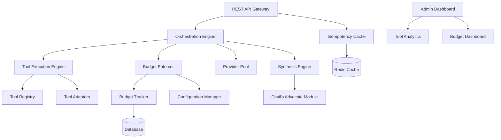

# Design Document

## Overview

The Council Enhancements feature extends the AI Council Proxy with five production-critical capabilities that address real-world failure modes in multi-agent systems. These enhancements build on the existing architecture without requiring fundamental changes, instead adding new components and extending existing ones.

The enhancements are designed to be independently deployable - each can be enabled or disabled without affecting the others. This modular approach allows gradual rollout and testing in production environments.

Key design principles:
- **Backward compatibility**: All enhancements are optional and do not break existing functionality
- **Performance-first**: Idempotency caching and parallel tool execution minimize latency overhead
- **Cost control**: Budget caps provide hard limits to prevent runaway spending
- **Flexibility**: Per-request transparency and devil's advocate strategies adapt to different use cases
- **Observability**: All enhancements integrate with existing logging and dashboard infrastructure

## Architecture

### Enhanced Component Architecture



### New Components

1. **Idempotency Cache**: Manages request deduplication using Redis
2. **Tool Execution Engine**: Orchestrates parallel tool calls across Council Members
3. **Tool Registry**: Maintains available tools and their definitions
4. **Budget Enforcer**: Enforces spending limits and disables over-budget members
5. **Budget Tracker**: Tracks spending against configured caps
6. **Devil's Advocate Module**: Implements critique-based synthesis strategy

## Components and Interfaces

### 1. Idempotency Cache

**Responsibilities:**
- Check for duplicate requests using idempotency keys
- Cache completed request results for 24 hours
- Handle concurrent requests with the same key
- Cache error responses to prevent retries

**Interface:**

```typescript
interface IdempotencyCache {
  checkKey(key: string): Promise<IdempotencyStatus>;
  
  cacheResult(
    key: string,
    result: ConsensusDecision,
    ttl: number
  ): Promise<void>;
  
  cacheError(
    key: string,
    error: ErrorResponse,
    ttl: number
  ): Promise<void>;
  
  waitForCompletion(key: string): Promise<CachedResult>;
}

interface IdempotencyStatus {
  exists: boolean;
  status: 'completed' | 'in-progress' | 'failed' | 'not-found';
  result?: CachedResult;
}

interface CachedResult {
  requestId: string;
  consensusDecision?: ConsensusDecision;
  error?: ErrorResponse;
  timestamp: Date;
}
```

### 2. Tool Execution Engine

**Responsibilities:**
- Register available tools with their definitions
- Execute tool calls from Council Members
- Run multiple tool calls in parallel
- Track tool usage per Council Member
- Provide tool results back to Council Members

**Interface:**

```typescript
interface ToolExecutionEngine {
  registerTool(tool: ToolDefinition): void;
  
  getAvailableTools(): ToolDefinition[];
  
  executeTool(
    toolName: string,
    parameters: Record<string, any>,
    councilMemberId: string
  ): Promise<ToolResult>;
  
  executeParallel(
    toolCalls: ToolCall[]
  ): Promise<ToolResult[]>;
  
  getToolUsageForRequest(
    requestId: string
  ): Promise<ToolUsage[]>;
}

interface ToolDefinition {
  name: string;
  description: string;
  parameters: ToolParameter[];
  adapter: string; // which adapter to use
}

interface ToolParameter {
  name: string;
  type: 'string' | 'number' | 'boolean' | 'object';
  description: string;
  required: boolean;
}

interface ToolCall {
  toolName: string;
  parameters: Record<string, any>;
  councilMemberId: string;
  requestId: string;
}

interface ToolResult {
  toolName: string;
  councilMemberId: string;
  success: boolean;
  result?: any;
  error?: string;
  latency: number;
  timestamp: Date;
}

interface ToolUsage {
  councilMemberId: string;
  toolName: string;
  parameters: Record<string, any>;
  result: ToolResult;
  roundNumber: number;
}
```

### 3. Budget Enforcer

**Responsibilities:**
- Track spending against configured budget caps
- Reject API calls that would exceed caps
- Mark Council Members as budget-disabled
- Re-enable members when budget periods reset
- Generate alerts when caps are reached

**Interface:**

```typescript
interface BudgetEnforcer {
  checkBudget(
    councilMember: CouncilMember,
    estimatedCost: number
  ): Promise<BudgetCheckResult>;
  
  recordSpending(
    councilMember: CouncilMember,
    actualCost: number
  ): Promise<void>;
  
  getBudgetStatus(
    providerId?: string,
    modelId?: string
  ): Promise<BudgetStatus[]>;
  
  resetBudgetPeriod(
    period: 'daily' | 'weekly' | 'monthly'
  ): Promise<void>;
}

interface BudgetCheckResult {
  allowed: boolean;
  reason?: string;
  currentSpending: number;
  budgetCap: number;
  percentUsed: number;
}

interface BudgetStatus {
  providerId: string;
  modelId?: string;
  period: 'daily' | 'weekly' | 'monthly';
  currentSpending: number;
  budgetCap: number;
  percentUsed: number;
  disabled: boolean;
  resetAt: Date;
}

interface BudgetCap {
  providerId: string;
  modelId?: string;
  dailyLimit?: number;
  weeklyLimit?: number;
  monthlyLimit?: number;
  currency: string;
}
```

### 4. Devil's Advocate Module

**Responsibilities:**
- Select devil's advocate Council Member
- Generate critique prompts
- Coordinate devil's advocate synthesis
- Adjust confidence based on critique strength
- Track devil's advocate effectiveness

**Interface:**

```typescript
interface DevilsAdvocateModule {
  selectDevilsAdvocate(
    members: CouncilMember[],
    strategy: DevilsAdvocateStrategy
  ): CouncilMember;
  
  generateCritiquePrompt(
    deliberationThread: DeliberationThread
  ): string;
  
  synthesizeWithCritique(
    thread: DeliberationThread,
    critique: string,
    synthesizer: CouncilMember
  ): Promise<ConsensusDecision>;
  
  adjustConfidence(
    baseConfidence: number,
    critiqueStrength: number
  ): number;
}

type DevilsAdvocateStrategy =
  | { type: 'designated'; memberId: string }
  | { type: 'strongest' }
  | { type: 'rotate' };

interface DevilsAdvocateCritique {
  councilMemberId: string;
  weaknesses: string[];
  alternatives: string[];
  potentialErrors: string[];
  overallStrength: number; // 0-1
}
```

### 5. Enhanced API Gateway

**Responsibilities:**
- Accept idempotency keys in request headers
- Handle per-request transparency parameter
- Check idempotency cache before processing
- Return cached results for duplicate requests

**Extended Interface:**

```typescript
interface EnhancedAPIRequest {
  query: string;
  sessionId?: string;
  streaming?: boolean;
  transparency?: boolean; // NEW: per-request transparency
  idempotencyKey?: string; // NEW: from header
}

interface EnhancedAPIResponse {
  requestId: string;
  status: 'processing' | 'completed' | 'failed';
  consensusDecision?: string;
  deliberationThread?: DeliberationThread; // included if transparency=true
  fromCache?: boolean; // NEW: indicates cached response
  toolUsage?: ToolUsage[]; // NEW: tool call information
}
```

## Data Models

### Database Schema Extensions

```sql
-- Idempotency cache (Redis)
-- Key: idempotency:{key}
-- Value: {requestId, status, result, timestamp}
-- TTL: 24 hours

-- Tool usage table
CREATE TABLE tool_usage (
  id UUID PRIMARY KEY,
  request_id UUID REFERENCES requests(id),
  council_member_id VARCHAR(255) NOT NULL,
  round_number INTEGER NOT NULL,
  tool_name VARCHAR(255) NOT NULL,
  parameters JSONB NOT NULL,
  result JSONB NOT NULL,
  success BOOLEAN NOT NULL,
  latency_ms INTEGER NOT NULL,
  created_at TIMESTAMP NOT NULL
);

-- Budget caps table
CREATE TABLE budget_caps (
  id UUID PRIMARY KEY,
  provider_id VARCHAR(255) NOT NULL,
  model_id VARCHAR(255),
  daily_limit DECIMAL(10,2),
  weekly_limit DECIMAL(10,2),
  monthly_limit DECIMAL(10,2),
  currency VARCHAR(10) NOT NULL,
  created_at TIMESTAMP NOT NULL,
  updated_at TIMESTAMP NOT NULL,
  UNIQUE(provider_id, model_id)
);

-- Budget spending table
CREATE TABLE budget_spending (
  id UUID PRIMARY KEY,
  provider_id VARCHAR(255) NOT NULL,
  model_id VARCHAR(255),
  period_type VARCHAR(20) NOT NULL, -- 'daily', 'weekly', 'monthly'
  period_start TIMESTAMP NOT NULL,
  period_end TIMESTAMP NOT NULL,
  current_spending DECIMAL(10,2) NOT NULL DEFAULT 0,
  disabled BOOLEAN DEFAULT FALSE,
  created_at TIMESTAMP NOT NULL,
  updated_at TIMESTAMP NOT NULL
);

-- Devil's advocate critiques table
CREATE TABLE devils_advocate_critiques (
  id UUID PRIMARY KEY,
  request_id UUID REFERENCES requests(id),
  council_member_id VARCHAR(255) NOT NULL,
  weaknesses TEXT[] NOT NULL,
  alternatives TEXT[] NOT NULL,
  potential_errors TEXT[] NOT NULL,
  overall_strength DECIMAL(3,2) NOT NULL,
  created_at TIMESTAMP NOT NULL
);

-- Indexes
CREATE INDEX idx_tool_usage_request_id ON tool_usage(request_id);
CREATE INDEX idx_tool_usage_council_member ON tool_usage(council_member_id);
CREATE INDEX idx_budget_spending_provider ON budget_spending(provider_id, model_id, period_type);
CREATE INDEX idx_devils_advocate_request ON devils_advocate_critiques(request_id);
```

## Error Handling

### New Error Categories

1. **Idempotency Errors**
   - Duplicate key with different request body
   - Cache unavailable during idempotency check
   - Concurrent request timeout

2. **Tool Execution Errors**
   - Tool not found
   - Tool execution timeout
   - Tool parameter validation failure
   - Tool adapter unavailable

3. **Budget Errors**
   - Budget cap exceeded
   - Budget period configuration invalid
   - Budget tracking unavailable

### Error Handling Strategy

**Idempotency Failures:**
- If cache is unavailable, process request normally and log warning
- If duplicate key with different body, return 409 Conflict
- If concurrent request times out, return 202 Accepted with retry-after header

**Tool Execution Failures:**
- Continue with available tool results if some tools fail
- Log all tool failures for debugging
- Include tool error information in deliberation context

**Budget Enforcement:**
- Reject requests immediately if budget exceeded
- Return 429 Too Many Requests with budget reset time
- Generate alert for administrator review

## Correctness Properties

*A property is a characteristic or behavior that should hold true across all valid executions of a system—essentially, a formal statement about what the system should do. Properties serve as the bridge between human-readable specifications and machine-verifiable correctness guarantees.*

### Idempotency Properties

Property 1: Idempotency key detection
*For any* idempotency key that has been processed within the last twenty-four hours, the system should identify it as previously processed.
**Validates: Requirements 1.1**

Property 2: Cached result return
*For any* idempotency key matching a completed request, the system should return the cached result without re-processing the request.
**Validates: Requirements 1.2**

Property 3: Concurrent request handling
*For any* idempotency key with an in-progress request, subsequent requests with the same key should wait and receive the same result.
**Validates: Requirements 1.3**

Property 4: Result caching with TTL
*For any* completed request with an idempotency key, the result should be cached with a twenty-four hour TTL.
**Validates: Requirements 1.4**

Property 5: Error caching
*For any* permanently failed request with an idempotency key, the error response should be cached to prevent retries.
**Validates: Requirements 1.5**

Property 6: Normal processing without key
*For any* request without an idempotency key, the system should process it normally without idempotency checks.
**Validates: Requirements 1.6**

### Tool Use Properties

Property 7: Tool definition inclusion
*For any* council member that supports tool use, the request should include available tool definitions.
**Validates: Requirements 2.1**

Property 8: Tool execution and result delivery
*For any* tool call made by a council member, the system should execute the tool and provide results to that member.
**Validates: Requirements 2.2**

Property 9: Parallel tool execution
*For any* set of tool calls from multiple council members, all tool calls should execute in parallel.
**Validates: Requirements 2.3**

Property 10: Tool result sharing
*For any* deliberation round, all council members should receive all tool usage and results from all other members.
**Validates: Requirements 2.4**

Property 11: Follow-up tool calls
*For any* council member reviewing peer tool usage, that member should be able to call additional tools for verification.
**Validates: Requirements 2.5**

Property 12: Tool insights in synthesis
*For any* synthesis operation, the consensus decision should reflect insights from all tool calls across all council members.
**Validates: Requirements 2.6**

Property 13: Tool usage dashboard display
*For any* request displayed in the dashboard, the system should show which tools were called by which council members and the results obtained.
**Validates: Requirements 2.7**

### Devil's Advocate Properties

Property 14: Critique prompt generation
*For any* synthesis using devil's advocate strategy, the system should instruct the designated member to identify weaknesses, alternatives, and potential errors.
**Validates: Requirements 3.2**

Property 15: Separate synthesizer
*For any* devil's advocate synthesis, the final synthesizer should be a different council member than the devil's advocate.
**Validates: Requirements 3.3**

Property 16: Strongest devil's advocate selection
*For any* devil's advocate strategy with strongest model option, the system should select the most capable council member.
**Validates: Requirements 3.4**

Property 17: Devil's advocate dashboard identification
*For any* request using devil's advocate synthesis displayed in the dashboard, the system should identify which member served as devil's advocate and highlight their critique.
**Validates: Requirements 3.5**

Property 18: Confidence adjustment
*For any* devil's advocate synthesis, the consensus decision should include a confidence adjustment based on critique strength.
**Validates: Requirements 3.6**

### Budget Control Properties

Property 19: Budget cap configuration
*For any* budget cap configuration, the system should accept and store daily, weekly, and monthly limits per provider and per model.
**Validates: Requirements 4.1**

Property 20: Budget cap enforcement
*For any* council member API call that would exceed a configured budget cap, the system should reject the call and mark that member as budget-disabled.
**Validates: Requirements 4.2**

Property 21: Budget-disabled exclusion
*For any* budget-disabled council member, the system should exclude it from subsequent requests until the budget period resets.
**Validates: Requirements 4.3**

Property 22: Budget warning thresholds
*For any* budget cap displayed in the dashboard, the system should show visual warnings at seventy-five percent and ninety percent thresholds.
**Validates: Requirements 4.4**

Property 23: Budget cap alert generation
*For any* budget cap that is reached, the system should generate an alert notification to administrators.
**Validates: Requirements 4.5**

Property 24: Budget period reset
*For any* budget period reset, the system should automatically re-enable budget-disabled members and reset spending counters.
**Validates: Requirements 4.6**

Property 25: Unlimited spending without caps
*For any* provider or model without a configured budget cap, the system should allow unlimited spending with standard cost tracking.
**Validates: Requirements 4.7**

### Per-Request Transparency Properties

Property 26: Per-request transparency enabled
*For any* request with transparency parameter set to true, the response should include the full deliberation thread.
**Validates: Requirements 5.1**

Property 27: Per-request transparency disabled
*For any* request with transparency parameter set to false, the response should return only the consensus decision regardless of global settings.
**Validates: Requirements 5.2**

Property 28: Default transparency behavior
*For any* request without a transparency parameter, the system should use the global transparency configuration.
**Validates: Requirements 5.3**

Property 29: Streaming with transparency
*For any* request with streaming and per-request transparency enabled, the system should stream deliberation exchanges in real-time.
**Validates: Requirements 5.4**

Property 30: Transparency flag in dashboard
*For any* request displayed in the dashboard, the system should indicate whether transparency was enabled for that specific request.
**Validates: Requirements 5.5**

Property 31: Forced transparency override
*For any* request when forced transparency is enabled globally, the system should override per-request transparency settings and always include deliberation threads.
**Validates: Requirements 5.6**

## Testing Strategy

The Council Enhancements will employ the same comprehensive testing strategy as the base AI Council Proxy: unit tests, integration tests, and property-based tests.

### Unit Testing

**Components to test:**
- Idempotency cache (hit/miss scenarios, TTL expiration)
- Tool execution engine (parallel execution, error handling)
- Budget enforcer (cap calculations, period resets)
- Devil's advocate module (critique generation, confidence adjustment)

### Integration Testing

**Test scenarios:**
- End-to-end request with idempotency key (duplicate detection)
- Multiple council members calling different tools in parallel
- Budget cap enforcement across multiple requests
- Devil's advocate synthesis with critique incorporation
- Per-request transparency override

### Property-Based Testing

**Configuration:** Each property test will run a minimum of 100 iterations using fast-check.

**Test tagging:** Each property-based test will include a comment: `**Feature: council-enhancements, Property {number}: {property_text}**`

## Security Considerations

### Idempotency Key Security

- Validate idempotency key format (max length, allowed characters)
- Prevent cache poisoning by validating request body matches
- Rate limit idempotency key generation per client

### Tool Execution Security

- Sandbox tool execution to prevent code injection
- Validate tool parameters against schema
- Implement tool execution timeouts
- Audit all tool calls for security review

### Budget Enforcement Security

- Prevent budget cap bypass through concurrent requests
- Audit budget configuration changes
- Alert on suspicious spending patterns

## Performance Optimization

### Idempotency Caching

- Use Redis for sub-millisecond cache lookups
- Implement cache warming for frequently used keys
- Use distributed locks for concurrent request handling

### Parallel Tool Execution

- Execute tool calls concurrently using Promise.all
- Implement tool execution timeout (default 30 seconds)
- Cache tool results within a request to avoid duplicate calls

### Budget Tracking

- Cache budget status in Redis (5-minute TTL)
- Batch budget updates to reduce database writes
- Use optimistic locking for concurrent spending updates

## Deployment Considerations

### Rollout Strategy

1. **Phase 1**: Deploy idempotency support (lowest risk, highest value)
2. **Phase 2**: Deploy per-request transparency (simple, no external dependencies)
3. **Phase 3**: Deploy budget enforcement (requires monitoring setup)
4. **Phase 4**: Deploy tool execution engine (requires tool adapters)
5. **Phase 5**: Deploy devil's advocate synthesis (requires testing)

### Feature Flags

All enhancements should be controlled by feature flags:
- `ENABLE_IDEMPOTENCY`
- `ENABLE_TOOL_USE`
- `ENABLE_DEVILS_ADVOCATE`
- `ENABLE_BUDGET_CAPS`
- `ENABLE_PER_REQUEST_TRANSPARENCY`

### Monitoring

- Track idempotency cache hit rate
- Monitor tool execution latency and failure rate
- Alert on budget cap violations
- Track devil's advocate critique effectiveness
- Monitor transparency usage patterns
